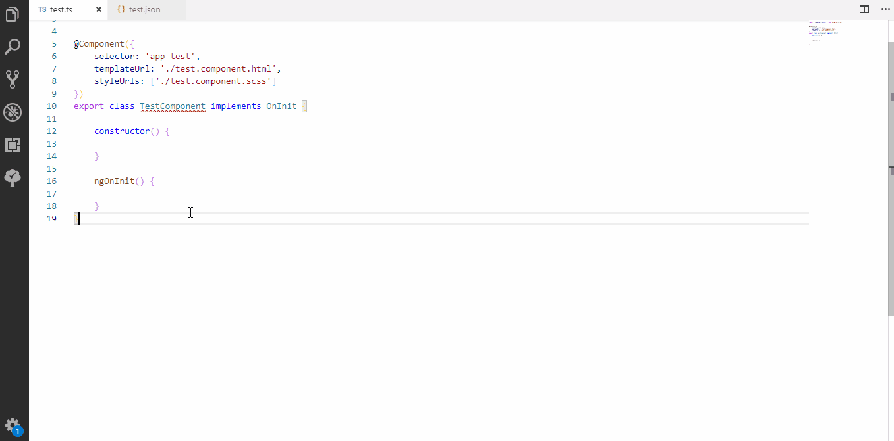
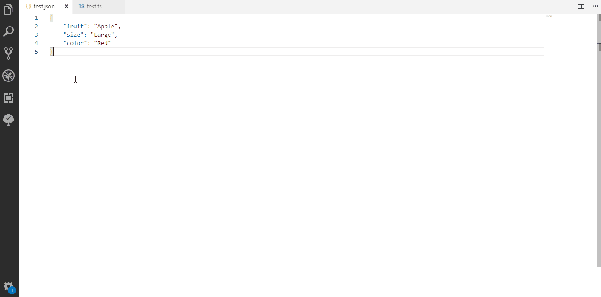
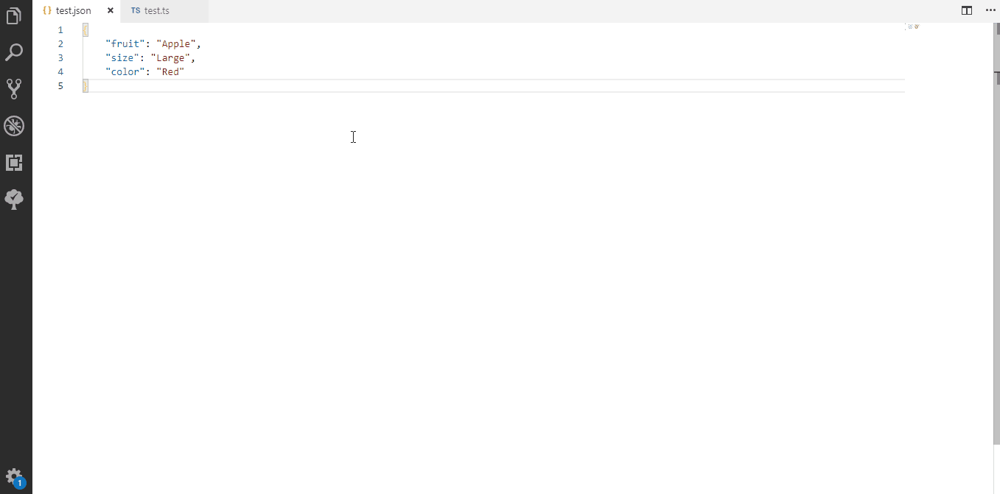

# JSON to Angular Reactive Form 

Generate Angular Reactive Form with simple json values. Just copy the json text and open a new tab in vs code editor and press ctrl+shift+p you will ask your form name. that's it you will get your angular reactive form.

## Features

#### Generate from clipboard
Generate Angular Reactive Form from JSON copied to the clipboard.


#### Generate from selection


#### Generate from JSON document


#### Generate from clipboard to the cursor position


## Installation
```
ext install json-2-reactive-form
```

## Release Notes

Find the release notes for the extension features below.

### 0.0.1

Initial release of paste json as reactive form

### 0.0.2

Added support to generate Reactive Form from JSON file.
Added support to generate Reactive Form from text selection within the file.
Paste JSON as Reactive Form from clipboard in the cursor position.
Added editor context menu items for easy access.
